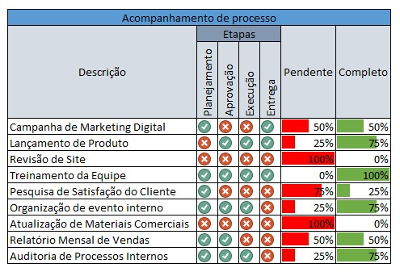

# 📊 Excel Project Tracker – Mini Dashboard de Projetos




## 🔹 Sobre

Esta é uma planilha simples para **acompanhar o progresso de projetos ou atividades** no Excel. Permite visualizar rapidamente:

* Status de cada etapa ✅/❌
* % Completo (barra verde)
* % Pendente (barra vermelha)

Tudo feito **apenas com fórmulas e formatação condicional**.

---

## 🔹 Estrutura da Planilha

| Coluna | Descrição                                                     |
| ------ | ------------------------------------------------------------- |
| A      | Nome da Atividade / Projeto                                   |
| B a E  | Etapas do projeto: Planejamento, Aprovação, Execução, Entrega |
| F      | % Pendente (calculado automaticamente)                        |
| G      | % Completo (calculado automaticamente)                        |

---

## 🔹 Passo a Passo para Criar

1. **Criar colunas e etapas**

   * Planejamento, Aprovação, Execução, Entrega

2. **Inserir valores de conclusão**

   * 0 → Pendente
   * 1 → Concluído

3. **Adicionar fórmulas de progresso**

   * **% Completo:**

   ```excel
   =CONT.SE(B4:E4;1)/4
   ```

   * **% Pendente:**

   ```excel
   =1 - G4
   ```

4. **Formatação Condicional**

   * Etapas:

     * 1 → fundo verde ou ícone ✅
     * 0 → fundo vermelho ou ícone ❌
   * % Pendente → Barra de dados vermelha
   *  % Completo → Barra de dados verde

5. **Validação de Dados**

   * Restringir as células das etapas para aceitar apenas **0 ou 1**
   * **Dados → Validação de Dados → Lista → 0,1**

---

## 🔹 Exemplos de Atividades / Projetos

* Campanha de Marketing Digital
* Lançamento de Produto
* Treinamento da Equipe
* Revisão de Site / Landing Page
* Relatório Mensal de Vendas

---

## 🔹 Dicas Extras

* Você pode adicionar mais etapas ou projetos conforme a necessidade.
* É possível calcular o **progresso total do projeto** ou **média da equipe**.
* Ótimo para **reuniões, acompanhamento de tarefas e visualização rápida do progresso**.

---

💻 **Download da Planilha:** [Dashboard\_projetos.xlsx](https://github.com/jeanvyctor/dashboard_projetos_excel/blob/main/Dashboard_projetos.xlsx) , depois em “View Raw” para baixar e mexer à vontade no seu computador.
